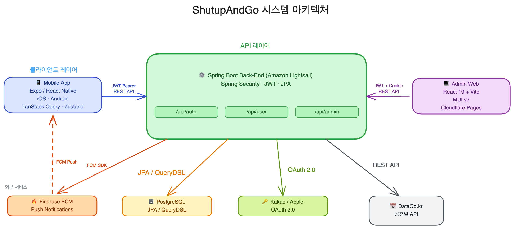
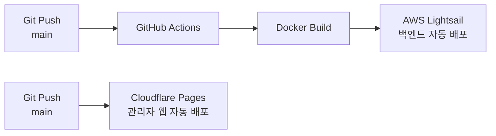

# ShutupAndGo 🏋️

  <strong>크로스핏 센터를 위한 통합 운영 관리 SaaS 플랫폼</strong> 
  아날로그로 운영되던 크로스핏 센터를 완전한 디지털 환경으로 전환합니다.

  

  
  
  
  
  
  
  
  
  

---

## Overview

**ShutupAndGo**는 크로스핏 센터 운영에 필요한 모든 기능을 하나로 통합한 SaaS 플랫폼입니다.
회원권 관리, 수업 예약, WOD 기록, 통계 대시보드까지 — 코치와 회원 모두를 위한 완성된 생태계를 제공합니다.

> 현재 **실제 크로스핏 센터의 코치와 회원이 사용 중**인 운영 서비스입니다.

### 개발 규모

| 항목 | 내용 |
|------|------|
| 개발 인원 | 1인 (기획 · 설계 · 개발 · 배포 · QA 전담) |
| 개발 기간 | 약 4개월 |
| 엔티티 수 | 29개 |
| API 수 | 130여 개 |
| 플랫폼 | iOS 앱 + 관리자 웹 |

---

## Key Features

### 👥 회원 & 회원권 관리
- 회원 등록, 조회, 상태 관리 (활성 / 정지 / 만료)
- 회원권 등록·정지·만료 **자동화** 처리
- 수강권 차감 및 잔여 횟수 실시간 추적

### 📅 수업 예약 시스템
- 코치가 수업 일정 생성, 회원이 앱에서 직접 예약
- 예약 취소 정책 및 정원 관리
- 미예약자 독려 자동 알림

### 💪 WOD & 기록 추적
- 일별 WOD(Workout of the Day) 등록 및 공유
- 회원별 개인 최고 기록(1RM) 관리
- 운동 히스토리 조회

### 📊 관리자 통계 대시보드
- QueryDSL 기반 동적 필터링으로 유연한 데이터 조회
- 매출, 회원 현황, 예약률 등 핵심 지표 시각화
- 기간별 / 회원권 유형별 세분화 분석

### 🔐 인증 & 보안
- **카카오 소셜 로그인** / **애플 로그인** 지원
- JWT 기반 Access Token + Refresh Token 인증 흐름
- 역할 기반 접근 제어 (회원 / 코치 / 관리자)

### 🤖 자동화 스케줄러 4종
- 회원권 만료 D-7 / D-1 사전 알림
- 수업 당일 미예약자 독려 푸시 알림
- 만료 회원 상태 자동 전환
- 정기 정산 데이터 갱신

### 🔔 푸시 알림
- FCM 기반 실시간 푸시 알림
- 예약 확정 / 수업 변경 / 만료 안내 등 이벤트 구독

---

## Tech Stack

### Backend
| 기술 | 버전 / 내용 |
|------|------------|
| Java | 25 (Eclipse Temurin) |
| Spring Boot | 4.0.5 |
| Spring Data JPA + QueryDSL | 5.1.0 — ORM 및 동적 쿼리 |
| JJWT | 0.12.6 — JWT 서명/검증 |
| Firebase Admin SDK | 9.4.3 — FCM 푸시 알림 |
| SpringDoc OpenAPI | 3.0.0 — Swagger UI |
| PostgreSQL | 주 데이터베이스 |
| Docker | 컨테이너화 |
| AWS Lightsail | 서버 인프라 |
| GitHub Actions | CI/CD 자동화 |

### Admin Web
| 기술 | 버전 / 내용 |
|------|------------|
| React | 19.1 |
| TypeScript | 5.8 |
| Vite | 6.2 (SWC 트랜스파일) |
| Material-UI (MUI) | v7 |
| TanStack Query | v5 — 서버 상태 및 캐싱 |
| React Router | v7 |
| ApexCharts | v4 — 통계 차트 |
| TipTap | v3 — 리치 텍스트 에디터 |
| Cloudflare Pages | 배포 + API 프록시 |

### Mobile App (iOS)
| 기술 | 버전 / 내용 |
|------|------------|
| Expo (Dev Client) | SDK 54 |
| React Native | 0.81.5 |
| Expo Router | v6 — 파일 기반 라우팅 |
| TanStack Query | v5 — 서버 상태 관리 |
| Zustand | v5 — 클라이언트 상태 관리 |
| Firebase FCM + Notifee | 푸시 알림 수신 및 표시 |
| Expo Updates | OTA 자동 업데이트 |
| Google Mobile Ads | 인앱 광고 |
| EAS Build | 클라우드 빌드 / App Store 배포 |

### AI-Assisted Development
- **Claude Code** — 설계 검토, 코드 리뷰, 리팩토링
- **Codex** — 반복 패턴 코드 생성 보조

---

## Architecture

**배포 파이프라인:**

| 플랫폼 | 용도 |
|--------|------|
| AWS Lightsail | Spring Boot 백엔드 (Docker) |
| Cloudflare Pages | 관리자 웹 (React + API 프록시 함수) |
| Apple App Store | iOS 모바일 앱 (EAS Build + OTA 업데이트) |

---

## Screenshots

> 📱 스크린샷 준비 중

---

## Download

---

## Source Code

이 저장소는 **홍보 및 포트폴리오 목적의 쇼케이스 레포**입니다.
소스코드는 보안 및 비즈니스상의 이유로 비공개(private) 상태로 유지됩니다.

---

  1인 개발 · 기획부터 배포까지 · 2026

